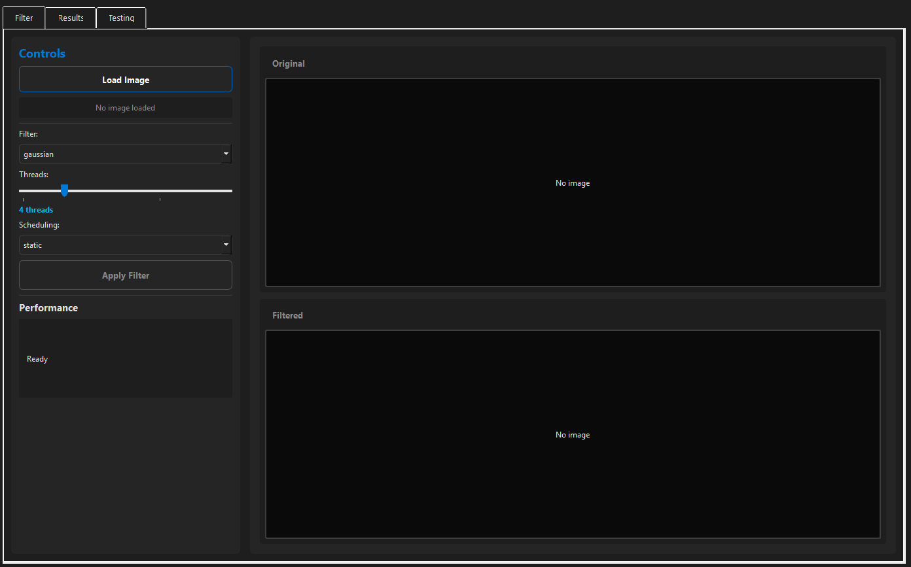
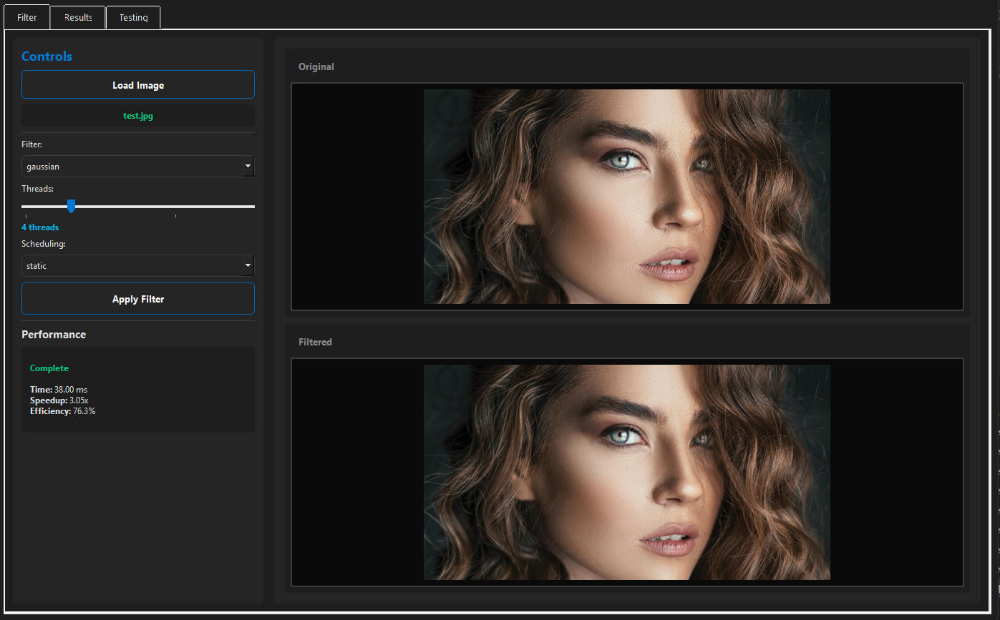
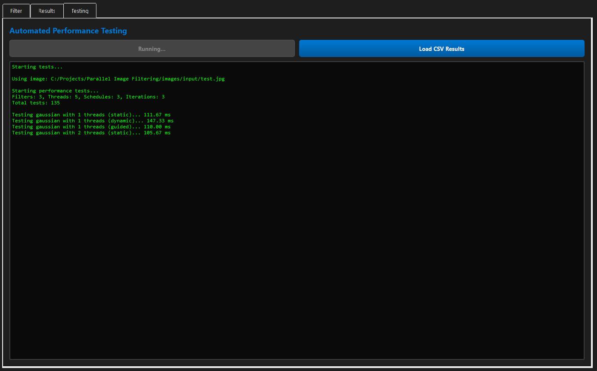
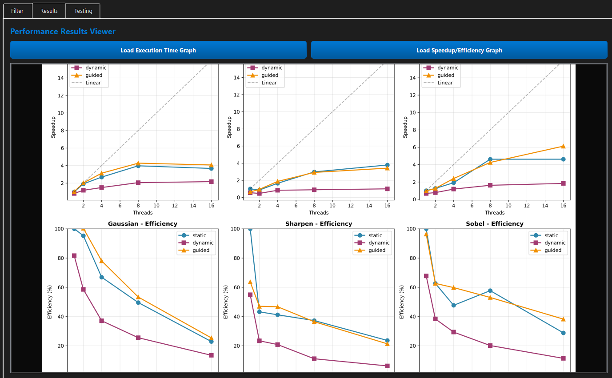

# Parallel Image Filters Using OpenMP

**CS361L Project** | Muhammad Shabih Ul Hassan Raja (2023506) | Syed Ghazi Abbas (2023679)

## What is This?

A parallel computing project that applies image filters using OpenMP. We're exploring how multi-threading speeds up image processing by implementing three filters:

1. **Gaussian Blur** - Smooths images
2. **Sharpen Filter** - Enhances edges  
3. **Sobel Edge Detector** - Detects edges

**Plus**: A clean Python GUI app for testing and visualization!

## Screenshots

### Main Interface

### Image Filtering in Action

### Automated Testing

### Performance Results

## Project Structure

Parallel Image Filtering/
├── src/parallel/      # OpenMP C implementation (1 thread = serial)
├── src/app/           # Python GUI modules
├── images/            # Input/output images
├── results/           # Performance data & graphs
└── lib/               # stb_image library

## Quick Setup

### 1. C/OpenMP
- Install GCC with OpenMP: gcc -fopenmp --version
- Download stb_image.h (https://github.com/nothings/stb) → place in lib/

### 2. Python GUI
Install the required dependencies:
pip install PyQt5 opencv-python pillow numpy matplotlib pandas psutil

## Run It

**Compile the C executable:**
gcc -O3 -fopenmp -Wall src/parallel/main.c src/parallel/filters.c src/parallel/image_utils.c -o src/parallel/filter.exe -lm

**Run the GUI App:**
python gui_app.py

**Run via CLI (Optional):**
# Syntax: ./filter.exe <input> <output> <filter_name> <threads> <schedule>
src/parallel/filter.exe input.jpg output.png gaussian 1 static    # Serial execution
src/parallel/filter.exe input.jpg output.png gaussian 8 static    # Parallel with 8 threads

## Features

- **Filter Tab**: Load images, apply filters with customizable thread counts and scheduling policies.
- **Results Tab**: View performance graphs. Metrics: Speedup, Efficiency, Execution Time. Test images: 1920x1080.
- **Testing Tab**: Run automated benchmarks across all filter/thread/scheduling combinations.

## Results

All performance graphs and test data are automatically generated and saved to results/:
- performance/results.csv - Raw benchmark data
- graphs/speedup_efficiency.png - Speedup and efficiency curves
- graphs/execution_time.png - Execution time comparison

## Project Status

1. ✅ Setup & Documentation
2. ✅ OpenMP Implementation (works as serial with 1 thread)
3. ✅ Performance Analysis & Testing
4. ✅ GUI Application with Real-time Monitoring
5. ✅ Automated Benchmarking

---

**CS361L** - Ghulam Ishaq Khan Institute | June 2026